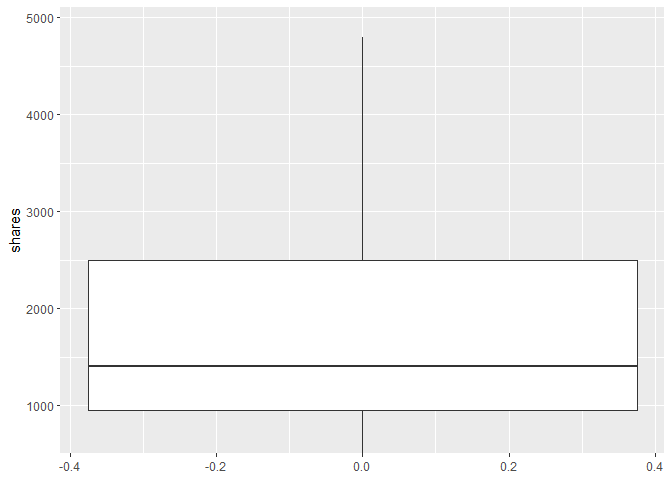
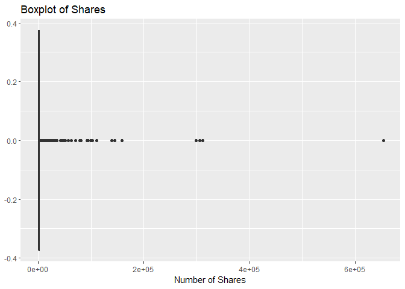

ST558 Project 2: Creating predictive models and automating Markdown
reports.
================
Josh Baber & Lan Lin
2022-07-06

Channel of interest: Business

Read in the data set

``` r
# Read in the data set and remove the non-predictive variables 
shares_Data <- read_csv("OnlineNewsPopularity.csv")[-2:-1]

# Remove the ones without channel 
shares_Data <- shares_Data[rowSums(shares_Data[12:17]) != 0, ]
```

Convert the dummy variables of channels to single categorical variable

``` r
# create a single variable representing the data channel
channel <- factor(cbind(VALUE = factor(max.col(shares_Data[12:17]), ordered = TRUE)))
# Set the levels of the channel variable
levels(channel) <- c( 'Lifestyle', 'Entertainment', 'Business', 'Social Media', 'Tech', 'World')

# Create a new data set using the single variable representing the data channel
shares_Data_chl <- shares_Data %>% select(-starts_with("data_channel")) %>% 
                     mutate(channel) %>% 
                     select(channel, everything())
```

Convert the dummy variables of weekdays to single categorical variable

``` r
# create a single variable representing the data weekdays
weekday <- factor(cbind(VALUE = factor(max.col(shares_Data_chl[25:31]), ordered = TRUE)))
levels(weekday) <- c("Monday", 'Tuesday',' Wednesday', 'Thursday',' Friday', 'Saturday', 'Sunday')

# Create a new data set using the single variable representing the data channel
shares_Data_chl <- shares_Data_chl %>% select(-starts_with("weekday_is")) %>% 
                     mutate(weekday) %>% 
                     select(channel, weekday, everything())

shares_Data_chl
```

    ## # A tibble: 33,510 x 48
    ##   channel       weekday n_tokens_title n_tokens_content n_unique_tokens n_non_stop_words n_non_stop_unique_tok~ num_hrefs num_self_hrefs num_imgs num_videos average_token_l~
    ##   <fct>         <fct>            <dbl>            <dbl>           <dbl>            <dbl>                  <dbl>     <dbl>          <dbl>    <dbl>      <dbl>            <dbl>
    ## 1 Entertainment Monday              12              219           0.664             1.00                  0.815         4              2        1          0             4.68
    ## 2 Business      Monday               9              255           0.605             1.00                  0.792         3              1        1          0             4.91
    ## 3 Business      Monday               9              211           0.575             1.00                  0.664         3              1        1          0             4.39
    ## 4 Entertainment Monday               9              531           0.504             1.00                  0.666         9              0        1          0             4.40
    ## 5 Tech          Monday              13             1072           0.416             1.00                  0.541        19             19       20          0             4.68
    ## # ... with 33,505 more rows, and 36 more variables: num_keywords <dbl>, kw_min_min <dbl>, kw_max_min <dbl>, kw_avg_min <dbl>, kw_min_max <dbl>, kw_max_max <dbl>,
    ## #   kw_avg_max <dbl>, kw_min_avg <dbl>, kw_max_avg <dbl>, kw_avg_avg <dbl>, self_reference_min_shares <dbl>, self_reference_max_shares <dbl>,
    ## #   self_reference_avg_sharess <dbl>, is_weekend <dbl>, LDA_00 <dbl>, LDA_01 <dbl>, LDA_02 <dbl>, LDA_03 <dbl>, LDA_04 <dbl>, global_subjectivity <dbl>,
    ## #   global_sentiment_polarity <dbl>, global_rate_positive_words <dbl>, global_rate_negative_words <dbl>, rate_positive_words <dbl>, rate_negative_words <dbl>,
    ## #   avg_positive_polarity <dbl>, min_positive_polarity <dbl>, max_positive_polarity <dbl>, avg_negative_polarity <dbl>, min_negative_polarity <dbl>,
    ## #   max_negative_polarity <dbl>, title_subjectivity <dbl>, title_sentiment_polarity <dbl>, abs_title_subjectivity <dbl>, abs_title_sentiment_polarity <dbl>, shares <dbl>

Subset the data to work on the Business data channel

``` r
shares <- shares_Data_chl %>% filter(channel == params$channel)
shares
```

    ## # A tibble: 6,258 x 48
    ##   channel  weekday n_tokens_title n_tokens_content n_unique_tokens n_non_stop_words n_non_stop_unique_tokens num_hrefs num_self_hrefs num_imgs num_videos average_token_leng~
    ##   <fct>    <fct>            <dbl>            <dbl>           <dbl>            <dbl>                    <dbl>     <dbl>          <dbl>    <dbl>      <dbl>               <dbl>
    ## 1 Business Monday               9              255           0.605             1.00                    0.792         3              1        1          0                4.91
    ## 2 Business Monday               9              211           0.575             1.00                    0.664         3              1        1          0                4.39
    ## 3 Business Monday               8              397           0.625             1.00                    0.806        11              0        1          0                5.45
    ## 4 Business Monday              13              244           0.560             1.00                    0.680         3              2        1          0                4.42
    ## 5 Business Monday              11              723           0.491             1.00                    0.642        18              1        1          0                5.23
    ## # ... with 6,253 more rows, and 36 more variables: num_keywords <dbl>, kw_min_min <dbl>, kw_max_min <dbl>, kw_avg_min <dbl>, kw_min_max <dbl>, kw_max_max <dbl>,
    ## #   kw_avg_max <dbl>, kw_min_avg <dbl>, kw_max_avg <dbl>, kw_avg_avg <dbl>, self_reference_min_shares <dbl>, self_reference_max_shares <dbl>,
    ## #   self_reference_avg_sharess <dbl>, is_weekend <dbl>, LDA_00 <dbl>, LDA_01 <dbl>, LDA_02 <dbl>, LDA_03 <dbl>, LDA_04 <dbl>, global_subjectivity <dbl>,
    ## #   global_sentiment_polarity <dbl>, global_rate_positive_words <dbl>, global_rate_negative_words <dbl>, rate_positive_words <dbl>, rate_negative_words <dbl>,
    ## #   avg_positive_polarity <dbl>, min_positive_polarity <dbl>, max_positive_polarity <dbl>, avg_negative_polarity <dbl>, min_negative_polarity <dbl>,
    ## #   max_negative_polarity <dbl>, title_subjectivity <dbl>, title_sentiment_polarity <dbl>, abs_title_subjectivity <dbl>, abs_title_sentiment_polarity <dbl>, shares <dbl>

Statistical summary of response variable shares

``` r
summary(shares$shares)
```

    ##     Min.  1st Qu.   Median     Mean  3rd Qu.     Max. 
    ##      1.0    952.2   1400.0   3063.0   2500.0 690400.0

Boxplot of shares

``` r
ggplot(shares, aes(y= shares)) + geom_boxplot(outlier.shape = NA) +
  coord_cartesian(ylim = quantile(shares$shares, c(0.1, 0.9)))
```

<!-- -->

Distribution of Shares by weekday using the shares data set. The
grouping variable weekday will be mapped to the y-axis:

``` r
ggplot(shares, 
       aes(x = shares, 
           y = weekday)) +
  geom_density_ridges(aes(fill = weekday)) + 
  coord_cartesian(xlim = quantile(shares$shares, c(0, 0.9))) +
  theme_ridges() +
  labs("Highway mileage by auto class") +
  theme(legend.position = "none")
```

<!-- --> channel,
weekday, n_tokens_title, n_tokens_content, n_unique_tokens,
n_non_stop_words, n_non_stop_unique_tokens, num_hrefs, num_self_hrefs,
num_imgs, num_videos, average_token_length, num_keywords, kw_min_min,
kw_max_min, kw_avg_min, kw_min_max, kw_max_max, kw_avg_max, kw_min_avg,
kw_max_avg, kw_avg_avg, self_reference_min_shares,
self_reference_max_shares, self_reference_avg_sharess, is_weekend,
LDA_00, LDA_01, LDA_02, LDA_03, LDA_04, global_subjectivity,
global_sentiment_polarity, global_rate_positive_words,
global_rate_negative_words, rate_positive_words, rate_negative_words,
avg_positive_polarity, min_positive_polarity, max_positive_polarity,
avg_negative_polarity, min_negative_polarity, max_negative_polarity,
title_subjectivity, title_sentiment_polarity, abs_title_subjectivity,
abs_title_sentiment_polarity, shares
