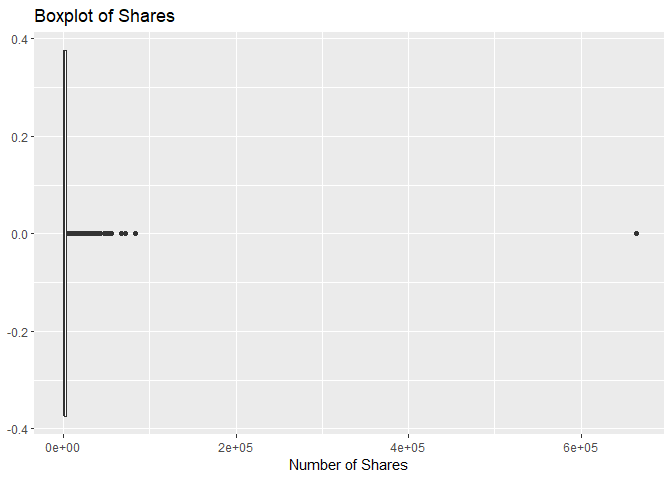
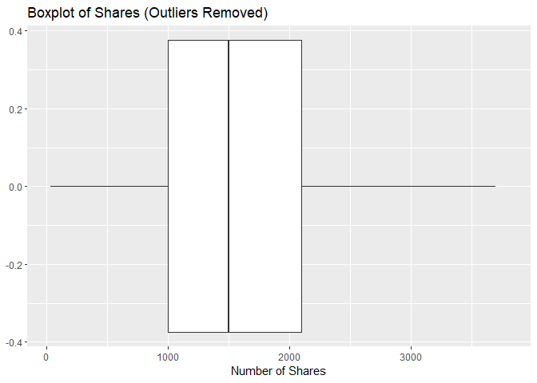
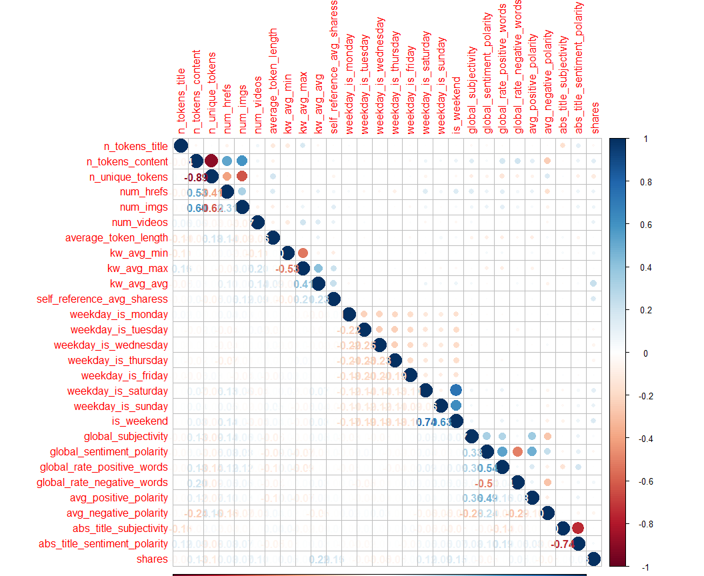
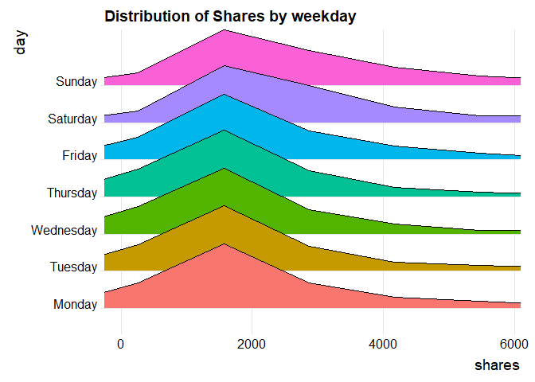
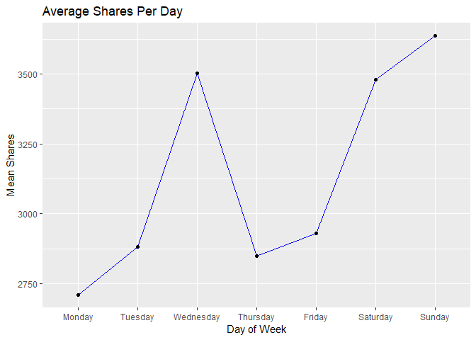
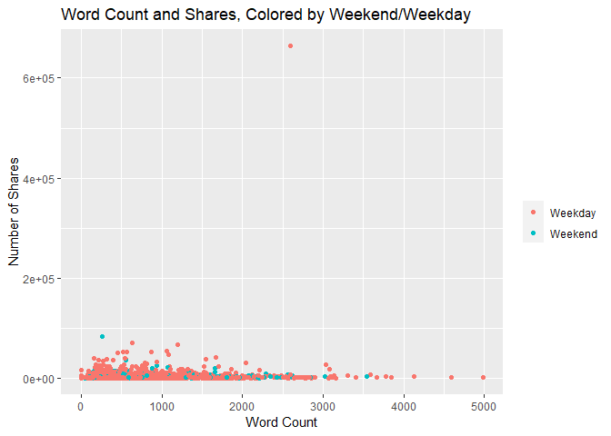
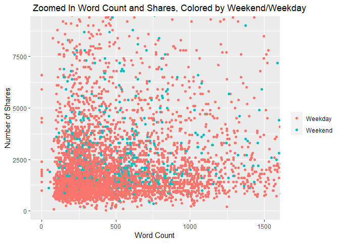
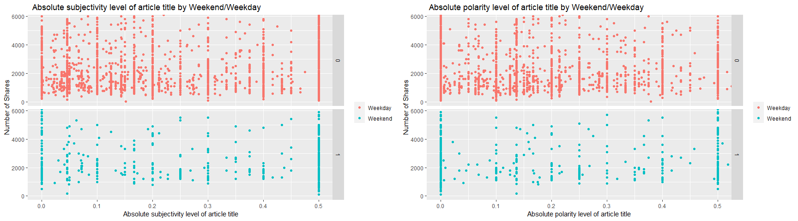
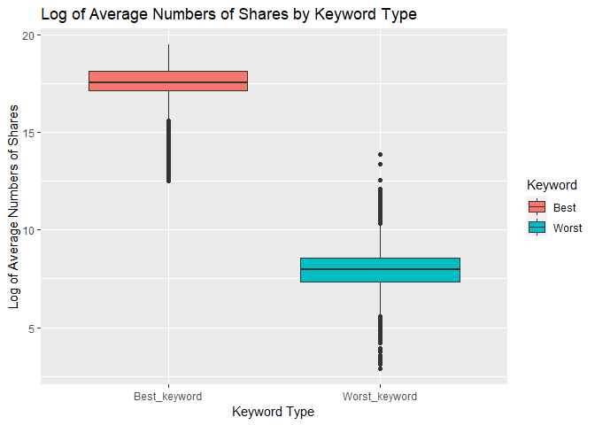

ST558 Project 2: Creating Predictive Models and Automating Markdown
Reports.
================
Josh Baber & Lan Lin
2022-07-06

-   [Channel of Interest: Tech](#channel-of-interest-tech)
    -   [Introduction](#introduction)
    -   [Read In Data and Prepare It For
        EDA](#read-in-data-and-prepare-it-for-eda)
    -   [Create Testing and Training Data
        Sets](#create-testing-and-training-data-sets)
    -   [Exploratory Data Analysis](#exploratory-data-analysis)
    -   [Model Fitting](#model-fitting)
    -   [Choose Best Model](#choose-best-model)
    -   [Conclusion](#conclusion)

# Channel of Interest: Tech

## Introduction

This report will be analyzing and fitting models on the [Online News
Popularity Data
Set](https://archive.ics.uci.edu/ml/datasets/Online+News+Popularity)
from UC Irvine’s machine learning repository. This data looks at nearly
60 variables and tries to predict the number of shares that an article
will get. We will be performing some basic exploratory data analysis
with tables and graphs, then will fit some models on the data to try to
predict the number of shares an article gets. We subset the number of
predictors to about 30. Many of the predictors in the data set are
indicator variables, which indicate things like day of the week or data
channel. Other important predictors include article word count, number
of videos or images or links in the article, the rate of positive or
negative words, and more. When fitting the models, we split the data
70/30 into training and testing sets, respectively. We will be fitting
four models on the training data: two linear regression models, a random
forest model, and a boosted tree model. At the end, we will be comparing
the root mean square error (RMSE) of each model on the testing set and
decide which one performed the best.

These are the packages we are going to be using.

## Read In Data and Prepare It For EDA

Read in the data set

``` r
# Read in the data set and remove the non-predictive variables 
shares_Data <- read_csv("OnlineNewsPopularity.csv")[-2:-1]
```

    ## Rows: 39644 Columns: 61
    ## -- Column specification -----------------------------------------------------------------------------------------------------------------------------------------------------
    ## Delimiter: ","
    ## chr  (1): url
    ## dbl (60): timedelta, n_tokens_title, n_tokens_content, n_unique_tokens, n_non_stop_words, n_non_stop_unique_tokens, num_hrefs, num_self_hrefs, num_imgs, num_videos, aver...
    ## 
    ## i Use `spec()` to retrieve the full column specification for this data.
    ## i Specify the column types or set `show_col_types = FALSE` to quiet this message.

``` r
# Remove the rows that have no channel assigned to them
shares_Data <- shares_Data[rowSums(shares_Data[12:17]) != 0, ]
```

Convert the dummy variables of channels to single categorical variable

``` r
# create a single variable representing the data channel
channel <- factor(cbind(VALUE = factor(max.col(shares_Data[12:17]), ordered = TRUE)))
# Set the levels of the channel variable
levels(channel) <- c( 'Lifestyle', 'Entertainment', 'Business', 'Social Media', 'Tech', 'World')
# Create a new data set using the single variable representing the data channel
shares_Data_chl <- shares_Data %>% select(-starts_with("data_channel")) %>% 
                     mutate(channel) %>% 
                     select(channel, everything())
```

Subset the data to work on the data channel of interest.

``` r
# Filter data to only contain channel of interest
shares_Channel <- shares_Data_chl %>% filter(channel == params$channel)
```

Subset the data set to contain only the columns/variables we will be
using.

``` r
# These are the column numbers of the variables we will be using
varcols <- c(2:4, 7, 9:11, 15, 18, 21, 24:32, 38:41, 44, 47, 52:54)
# Subset lifestyles table into relevant columns
shares_Channel <- shares_Channel[,varcols]
```

## Create Testing and Training Data Sets

We randomly divide up the data in 70% training data and 30% testing data
using `createDataPartition()`.

``` r
# Split indices into testing and training
trainIndices <- createDataPartition(shares_Channel$shares, p = 0.7, list = FALSE)
# Create training set from indices
channelTrain <- shares_Channel[trainIndices,]
# Create testing set from remaining indices
channelTest <- shares_Channel[-trainIndices,]
```

## Exploratory Data Analysis

First, we should look at the summary statistics of the response variable
“shares” using `summary()`. This gives us an idea of the distribution of
the number of shares.

``` r
summary(channelTrain$shares)
```

    ##    Min. 1st Qu.  Median    Mean 3rd Qu.    Max. 
    ##      36    1100    1700    3056    3000  663600

We can create a boxplot of number of shares to see how they are
distributed using `geom_boxplot()`.

``` r
#Create basic boxplot of shares
ggplot(channelTrain, aes(x = shares)) + geom_boxplot() + labs(title = "Boxplot of Shares") + 
  xlab("Number of Shares")
```

<!-- -->

Since there are some pretty large outliers in the number of shares, we
can create a boxplot to “zoom in” on it to see how the majority of the
data is dispersed. To do this, we use the `scale_x_continous()` function
and set the limits to be the minimum share count on the low end and
twice the IQR on the high end. We also say `outlier.shape = NA` to
remove outlier points.

``` r
# Same code as above to create but with outlier.shape = NA and
# scale_x_continous to scale the plot down
ggplot(channelTrain, aes(x = shares)) + geom_boxplot(outlier.shape = NA) +
  scale_x_continuous(limits = c(min(channelTrain$shares), 2*IQR(channelTrain$shares))) + 
  labs(title = "Boxplot of Shares (Outliers Removed)") + xlab("Number of Shares")
```

    ## Warning: Removed 910 rows containing non-finite values (stat_boxplot).

<!-- -->

Then, we look at how the response variable shares differs across
different groupings within the data.

Create a visual of the correlations of variables using `corrplot()`. The
darker the shades, the more correlated the variables are. Blue indicates
positive correlation and red indicates negative correlation.

``` r
# Find the correlations of the variables in the data
Correlation <- cor(channelTrain, method = "spearman")
# Create a visual of the correlations
corrplot(Correlation, type = "upper", tl.pos = "lt")
corrplot(Correlation, type = "lower", method = "number", add = TRUE, diag = FALSE, tl.pos = "n")
```

<!-- -->

Then, we look at how the response variable shares differs across
weekdays.

Similar to how we created the “channel” variable earlier, we can create
a “day” variable from the “weekday_is\_\*” dummy variables. Next, we can
create a new data set that has this column, and `group_by()` “day” to
see some summary statistics of shares by each day. Use `summarize()` to
find the mean, median, minimum, maximum, and standard deviation of
shares for each day of the week.

``` r
# create a single variable representing the day of the week  
day <- factor(cbind(VALUE = factor(max.col(channelTrain[12:18]), ordered = TRUE)))
# Specify a level for each day
levels(day) <- c('Monday', 'Tuesday', 'Wednesday', 'Thursday', 'Friday', 'Saturday', 'Sunday')
# Create a new data set using the single variable representing the day
daily_Channel_Train <- channelTrain %>% 
  select(-starts_with("weekday_is")) %>% 
  mutate(day) %>% 
  select(day, everything())
# Get the mean, median, minimum, maximum, and standard deviation
# of shares for each day
daily_Channel_Train %>% 
  group_by(day) %>%
  summarize(avgShares = mean(shares), medShares = median(shares), minShares = min(shares), 
            maxShares = max(shares), sdShares = sd(shares))
```

    ## # A tibble: 7 x 6
    ##   day       avgShares medShares minShares maxShares sdShares
    ##   <fct>         <dbl>     <dbl>     <dbl>     <dbl>    <dbl>
    ## 1 Monday        2708.      1700       211     38900    3074.
    ## 2 Tuesday       2882.      1600       104     67800    4272.
    ## 3 Wednesday     3504.      1600        36    663600   21353.
    ## 4 Thursday      2849.      1600        92     55200    4679.
    ## 5 Friday        2930.      1800        82     53200    4398.
    ## 6 Saturday      3479.      2200       119     37500    3798.
    ## 7 Sunday        3636.      2300       429     83300    5858.

Then, we can visualize the distribution of shares by weekday using
`geom_density_ridges()`. The grouping variable “day” will be mapped to
the y-axis. We can also subset the plot to only contain the first 90% of
the data using `coord_cartesian()`, since outliers will make the graph
otherwise hard to see.

``` r
# Create density plot of shares for each day
ggplot(daily_Channel_Train, 
       aes(x = shares, 
           y = day)) +
  geom_density_ridges(aes(fill = day)) + 
  coord_cartesian(xlim = quantile(daily_Channel_Train$shares, c(0, 0.9))) +
  theme_ridges() +
  labs(title = "Distribution of Shares by weekday") +
  theme(legend.position = "none")
```

    ## Picking joint bandwidth of 359

<!-- -->

Next, we can make a line graph to visualize how the average number of
shares changes by day. To do this we create a table of the average
shares for each day then plot them using `geom_line()` from `ggplot2`.

``` r
# Create table of daily averages
daily_Means <- daily_Channel_Train %>% 
  group_by(day) %>%
  summarize(avgShares = mean(shares))
# Create line plot with labels and titles
ggplot(daily_Means, aes(x = day, y = avgShares)) + 
  geom_line(aes(group = 1), color = "blue") + geom_point() + 
  labs(title = "Average Shares Per Day") + 
  xlab("Day of Week") + ylab("Mean Shares")
```

<!-- -->

Next, we should look at a contingency table that displays the counts of
articles produced each day using `table()`.

``` r
# Counts by day
table(daily_Channel_Train$day)
```

    ## 
    ##    Monday   Tuesday Wednesday  Thursday    Friday  Saturday    Sunday 
    ##       857      1026      1002       927       700       364       269

We can get a decent idea of the distribution of the number of links,
images, and videos in each article using `summarize()`.

``` r
# Get means and standard deviations
channelTrain %>% 
  summarize(avgLinks = mean(num_hrefs), sdLinks = sd(num_hrefs), avgImages = mean(num_imgs), 
            sdImages = sd(num_imgs), avgVideos = mean(num_videos), sdVideos = sd(num_videos))
```

    ## # A tibble: 1 x 6
    ##   avgLinks sdLinks avgImages sdImages avgVideos sdVideos
    ##      <dbl>   <dbl>     <dbl>    <dbl>     <dbl>    <dbl>
    ## 1     9.29    8.54      4.38     6.93     0.452     1.71

It may be important to see if the overall length, or word count, of the
article affects how many shares it gets. A reader may be discouraged
from sharing an article if it is too long, or they may not want to share
it if it doesn’t contain much information. We can look at a scatter plot
of n_tokens_content vs. shares using `geom_point()` to better get a
visualization of this relationship.

``` r
# Create scatter plot of n_tokens_content and number of shares
ggplot(data = channelTrain, aes(x = n_tokens_content, y = shares)) + 
  geom_point(aes(col = factor(is_weekend))) + 
  labs(title = "Word Count and Shares, Colored by Weekend/Weekday") + 
  xlab("Word Count") + ylab("Number of Shares") + 
  scale_color_discrete(name = " ", labels = c("Weekday", "Weekend"))
```

<!-- -->

Again, outliers may be an issue, and may make it harder to see the
relationships for most of the data. To scale down, we can use the
`coord_cartesian()` function to subset the amount of plot shown to
contain the first 95% of each variable using the `quantile()` function.

``` r
# Subset scatter plot to show the first 95% of the data for each variable
ggplot(data = channelTrain, aes(x = n_tokens_content, y = shares)) + 
  geom_point(aes(col = factor(is_weekend))) + 
  labs(title = " Zoomed In Word Count and Shares, Colored by Weekend/Weekday") + 
  xlab("Word Count") + ylab("Number of Shares") + 
  scale_color_discrete(name = " ", labels = c("Weekday", "Weekend")) + 
  coord_cartesian(xlim = c(0, quantile(channelTrain$n_tokens_content, 0.95)),  
                  ylim = c(0, quantile(channelTrain$shares, 0.95)))
```

<!-- -->

It may be also important to see if the absolute subjectivity level and
absolute polarity level of the article’s title affects how many shares
it gets. For example, if the article title is too sentimental, a reader
may consider it as un-professional and be discouraged from sharing an
article. We can look at a scatter plot of abs_title_subjectivity
vs. shares using `geom_point()` to better get a visualization of this
relationship, and compare it with a scatter plot of
abs_title_sentiment_polarity vs. shares side-by-side using
`grid.arrange()`. Again, we need to use `coord_cartesian()` here to
include only the first 90% of the data to avoid seeing huge outliers. We
also separated the scatter plots based on whether or not it was a
weekday and plotted them separately using `fact_grid()`.

``` r
# First make scatter plots of the subjectivity vs. shares separated by weekend/weekday
plot_title_subjectivity <- ggplot(data = channelTrain, aes(x = abs_title_subjectivity, y = shares)) + 
                             geom_point(aes(col = factor(is_weekend)),position = "jitter") +
                             facet_grid(factor(is_weekend) ~.) +
                             labs(title = "  Absolute subjectivity level of article title by Weekend/Weekday") + 
                               xlab(" Absolute subjectivity level of article title") + ylab("Number of Shares") + 
                             scale_color_discrete(name = " ", labels = c("Weekday", "Weekend")) +
                             coord_cartesian(xlim = c(0, quantile(channelTrain$abs_title_subjectivity, 0.9)),  
                               ylim = c(0.2, quantile(channelTrain$shares, 0.9)))
# Next, make scatter plots of sentiment vs. shares separated by weekend/weekday
plot_title_sentiment_polarity <- ggplot(data = channelTrain, aes(x = abs_title_sentiment_polarity, y = shares)) + 
                                   geom_point(aes(col = factor(is_weekend)),position = "jitter") +
                                   facet_grid(factor(is_weekend) ~.) +
                                   labs(title = " Absolute polarity level of article title by Weekend/Weekday") + 
                                     xlab("Absolute polarity level of article title") + ylab("Number of Shares") + 
                                   scale_color_discrete(name = " ", labels = c("Weekday", "Weekend")) +
                                   coord_cartesian(xlim = c(0, quantile(channelTrain$abs_title_sentiment_polarity, 0.9)),  
                                     ylim = c(0.2, quantile(channelTrain$shares, 0.9)))
# Arranged the plots in a 1 row, 2 column grid
grid.arrange(plot_title_subjectivity, plot_title_sentiment_polarity, nrow=1, ncol=2)
```

<!-- -->

We are also interested in how “best” and “worst” keywords affect the
average numbers of shares. A reader may be discouraged from sharing an
article if its keywords are too negative. We can look at a box plot of
type of keywords vs. log(avg.shares) using `geom_boxplot()` to better
get a visualization of this relationship.

``` r
# Create a keywords data set to plot
keywords <- as_tibble(data.frame(avg.shares = c(channelTrain$kw_avg_min, channelTrain$kw_avg_max), 
                                  keywords = c(rep("Worst_keyword", nrow(channelTrain)), rep("Best_keyword", nrow(channelTrain))))) 
# Create a box plot
ggplot(data = keywords, aes(x = keywords, y = log2(avg.shares), fill = keywords)) + 
  geom_boxplot() +
  labs(title =  "Log of Average Numbers of Shares by Keyword Type",
         x = "Keyword Type", y = "Log of Average Numbers of Shares") +
  scale_fill_discrete(name = "Keyword", labels = c("Best", "Worst"))
```

    ## Warning in FUN(X[[i]], ...): NaNs produced

    ## Warning in FUN(X[[i]], ...): NaNs produced

    ## Warning: Removed 94 rows containing non-finite values (stat_boxplot).

<!-- -->

## Model Fitting

Now that we have a good idea of how the data is distributed and
different variables interact with each other, we can fit models to the
data in order to predict the number of shares an article will get based
on the predictors we’ve been using. First, we are going to fit two
linear regression models using LASSO regression and Poisson regression.
Then we are going to fit a boosted tree model and a random forest model.

We are also going to use parallel processing using the `doParallel`
package to fit these models faster. To avoid collinearity issues, we
will use the training set and testing set that has the “day” column
instead of the dummy variables. We must also drop the `is_weekend`
column from our testing and training data sets to avoid collinearity
issues with the “day” column.

``` r
# create a single variable representing the day of the week for the testing set.
day <- factor(cbind(VALUE = factor(max.col(channelTest[12:18]), ordered = TRUE)))
# Specify a level for each day
levels(day) <- c('Monday', 'Tuesday', 'Wednesday', 'Thursday', 'Friday', 'Saturday', 'Sunday')
# Create a new testing data set that uses the single variable representing the day
daily_Channel_Test <- channelTest %>% 
  select(-starts_with("weekday_is")) %>% 
  mutate(day) %>% 
  select(day, everything())
daily_Channel_Train <- daily_Channel_Train %>% select(-is_weekend)
daily_Channel_Test <- daily_Channel_Test %>% select(-is_weekend)
```

### What is Linear Regression?

-   Linear regression attempts to model the relationship between a
    scalar response and one or more explanatory variables by fitting a
    linear equation to observed data. The case of one explanatory
    variable is called simple linear regression; and for more than one,
    the process is called multiple linear regression.

-   Overfitting occurs when a statistical model fits exactly against its
    training data, but cannot perform accurately against unseen data.
    This is where shrinkage methods come in play. These methods apply a
    penalty term to the Loss function used in the model. Minimizing the
    loss function is equal to maximizing the accuracy. The best-known
    shrinking methods are Ridge Regression and Lasso Regression which
    are often used in place of Linear Regression.

-   The generalized linear model expands the general linear model so
    that the dependent variable is linearly related to the factors and
    covariates via a specified link function. Moreover, the model allows
    for the dependent variable to have a non-normal distribution. It
    covers widely used statistical models, such as linear regression for
    normally distributed responses, logistic models for binary data,
    poison models for count data etc.

### LASSO Model

I used the LASSO method to perform to choose a subset of predictors that
best predicts the number of shares. This helps when we have a ton of
predictors and some of them have high collinearity. The motivation for
LASSO regression comes from the bias-variance trade-off. Having many
predictors can lead to low bias, but high variance, which can be a
problem when it comes to predicting the testing set. So using LASSO
selection will trade a little bit of bias to reduce the variance
significantly, leading to a better model.

Fit a LASSO trained model using the training data with `train()` and
standardize the data with `preProcess()`. Also use the tuning parameter
“fraction” to choose the best shrinkage out of 0.01, 0.05, and 0.1. Use
10-fold cross validation here to ensure we get a more solid tuning
parameter choice and model choice.

``` r
# Linear Regression Model using LASSO
lassoFit <- train(shares ~ ., data = daily_Channel_Train, method = "lasso",
                  trControl = trainControl(method = "cv", number = 10),
                  tuneGrid = expand.grid(fraction = c(0.01, 0.05, 0.1)),
                  preProcess = c("center", "scale"))
```

Now that we have the model fit, we can see how well it predicts the
shares in the test set. We make our predictions using `predict()` and
get the error diagnostics using `postResample()`.

``` r
# Make predictions with linear model
predslinear <- predict(lassoFit, newdata = daily_Channel_Test)
# See how well the model fits
postResample(predslinear, obs = daily_Channel_Test$shares)
```

    ##         RMSE     Rsquared          MAE 
    ## 5.477868e+03 3.302094e-03 2.374683e+03

### Poisson Regression Model

Poisson distribution is useful for modeling counts, which we are
counting number of shares. So, we fit a poisson trained model using the
training data with `train()`, specify `method = "glm"` and
`family = "poisson"`, and standardize the data with `preProcess()`.
Also, perform 10-fold cross validation to select the best model using
`trainControl()`.

``` r
poiFit <- train(shares ~ ., data = daily_Channel_Train, method = "glm", 
                family=poisson(link = "log"),
                trControl = trainControl(method = "cv", number = 10),
                preProcess = c("center", "scale"))
```

Now that we have the poisson model fit, we can see how well it predicts
the shares in the test set. We make our predictions using `predict()`
and get the error diagnostics using `postResample()`.

``` r
# Make predictions with poisson regression model
predsPoi <- predict(poiFit, newdata = daily_Channel_Test)
# See how well the model fits
postResample(predsPoi, obs = daily_Channel_Test$shares)
```

    ##         RMSE     Rsquared          MAE 
    ## 5.485850e+03 1.234891e-02 2.371680e+03

### Boosted Tree Model

Before I explain what a Boosted Tree model is, I must first explain the
concept of a regression tree. Regression trees split up the predictors
into regions, based on optimal values of predictors. If the tree decides
to split at one value, it may decide to split again at another value
afterwards, effectively create a branch that has many branches. The data
point is then predicted depending on where it falls in the decision
tree. There can be very many branches and splits, which is not always
the best case, so to avoid this, we can create many, many trees, and try
to come up with an agreeable, less complex decision tree.  
Boosted Tree models do this through a gradient approach. It starts its
predictions at 0, then measures how well it predicts the data. It then
creates a tree with a predetermined number of splits, which improves the
model, but only by a small amount (controlled by shrinkage). It
continues to build on the tree until it converges upon an optimal model
that minimizes prediction error.

Fit a boosted tree model using `train()`. We need to specify
`method = "gbm"` and there are four tuning parameters that we need to
select including shrinkage, number of trees, tree depth, and minimum
node observations. I specified 4 possible values for each of these
tuning parameters, so using `expand.grid()` in the `tuneGrid` argument,
the algorithm will search for the best combination out of 4^4 = 256
total combinations. I perform 10-fold cross validation here using
`trainControl()` in order to help choose the best combination of tuning
parameters.

``` r
# Values of n.trees
nTrees <- c(10, 50, 100, 200)
# Values of interaction.depth
intDepth <- c(1, 2, 3, 4)
# Value of shrinkage
shrink <- c(0.001, 0.05, 0.1, 0.5)
# Value of n.minobsinnode
nodeMinN <- c(5, 10, 15, 20)
# Fit the boosted tree model on the training data
boostFit <- train(shares ~ ., data = daily_Channel_Train, method = "gbm",
                        # Perform 5 fold cross validation repeated 3 times
                        trControl = trainControl(method = "cv", number = 10),
                        # Standardize the data, hide output with verborse = FALSE
                        preProcess = c("center", "scale"), verbose = FALSE,
                        # Check all possible combinations of n.trees, interaction.depth,
                        # shrinkage, and n.minobsinnode tuning parameters
                        tuneGrid = expand.grid(n.trees = nTrees, interaction.depth = intDepth,
                                               shrinkage = shrink, n.minobsinnode = nodeMinN))
```

Now we can make predictions and get the model diagnostics using the
testing set.

``` r
# Make predictions with boosted model
predsBoost <- predict(boostFit, newdata = daily_Channel_Test)
# Check model fit diagnostics
postResample(predsBoost, obs = daily_Channel_Test$shares)
```

    ##         RMSE     Rsquared          MAE 
    ## 5.490861e+03 5.098972e-03 2.390193e+03

### Random Forest Model

The random forest algorithm is an extension of the bagging method as it
utilizes both bagging and feature randomness to create an uncorrelated
forest of decision trees. It averages splits over many individually
created trees, but it randomly selects “m” predictors for each tree, so
as to avoid collinearity and to reduce variability. Now, we create a
random forest model using `train()` and specifying `method = "rf"`. We
use `tuneGrid` to try subsets of size m= c(5, 10, 15, 20) for
computational ease.. We also used `trainControl()` to do 5-fold cross
validation to help select the best “m” value.

``` r
# Parallel Processing
cores <- detectCores()
cl <- makePSOCKcluster(cores -1)  
registerDoParallel(cl)

rfFit <- train(shares ~ ., data = daily_Channel_Train, method = "rf",
               trControl = trainControl(method = "cv", number = 5),
               preProcess = c("center", "scale"),
               tuneGrid = data.frame(mtry = c(5, 10, 15, 20)))
```

Now we can make predictions and get the model diagnostics using the
testing set.

``` r
# Make predictions with random forest model
predsRf <- predict(rfFit, newdata = daily_Channel_Test)
# Check model fit diagnostics
postResample(predsRf, obs = daily_Channel_Test$shares)
```

    ##         RMSE     Rsquared          MAE 
    ## 6.027432e+03 1.211813e-02 2.462446e+03

## Choose Best Model

Write a function that finds the best model out of our four models based
on the lowest RMSE. It does the same `postResample()` process as before,
but it then finds the minimum RMSE of the models, and it prints out a
data frame of the fit diagnostics and a message that says which is the
best model based on RMSE.

``` r
# Create a function to find the best model 
get_bestModel <- function(lasso, poi, boost, rf){
  # Put all the fit results in a data frame
  fit.results <- data.frame(rbind("Lasso"= postResample(lasso, daily_Channel_Test$shares),
                                  "Poisson"= postResample(poi, daily_Channel_Test$shares),
                                  "Boosted Tree"= postResample(boost, daily_Channel_Test$shares),
                                  "Random Forest" = postResample(rf, daily_Channel_Test$shares)))
  # Select the RMSE and MAE columns for comparison
  fit.results <- fit.results[,-2]
  # Return the row name of the model which has the smallest RMSE as a string
  best_model_name <- row.names(fit.results)[fit.results$RMSE == min(fit.results$RMSE)]
  # Return both the data frame of RMSE and MAE columns, as well as the string of best model name in a list
  return(list(fit.results, best_model_name))
}
```

Apply this function to our models to assess their fit and decide which
one is the best.

``` r
# Apply function and save it as "best_model"
best_model <- get_bestModel(predslinear, predsPoi, predsBoost, predsRf)
# Print out the data frame of RMSE and MAE
best_model[[1]]
```

    ##                   RMSE      MAE
    ## Lasso         5477.868 2374.683
    ## Poisson       5485.850 2371.680
    ## Boosted Tree  5490.861 2390.193
    ## Random Forest 6027.432 2462.446

``` r
# Print out a message that tells us which model is the best based on lowest RMSE
print(paste("The best model by finding the RMSE on the test data is the", best_model[[2]], "model."))
```

    ## [1] "The best model by finding the RMSE on the test data is the Lasso model."

## Conclusion

In this project, we used automation to find summaries, graphs, and
models for predictions for each of six channels separately. We can
recycle the code for EDA and model fitting based on the channel for this
document. We used the same set of predictors to predict the number of
shares that an article gets in the given channel category. Lastly, we
were able to decide which model fit the best based on the least RMSE.
The best model for predicting shares in the Tech category was the Lasso
model.
